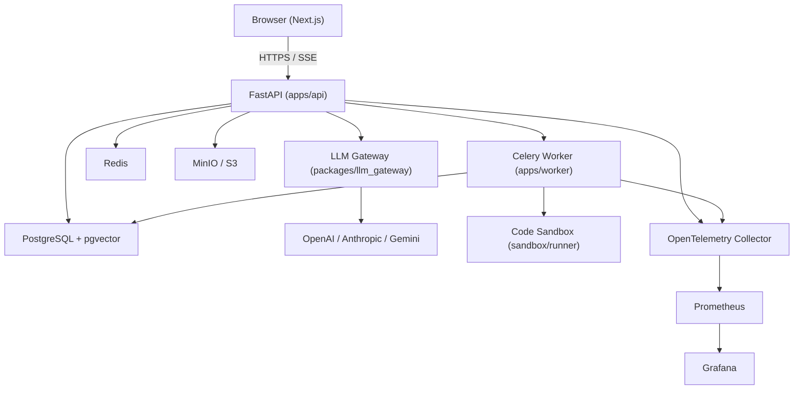

# AI Talent Platform

> Open-source AI-powered talent assessment, recruiting, coding interview and LLM evaluation platform.

[](https://github.com/UsamaMatrix/AI-Talent-Platform/actions/workflows/backend-ci.yml)
[](https://github.com/UsamaMatrix/AI-Talent-Platform/actions/workflows/frontend-ci.yml)
[](LICENSE)

---

## Product overview

The AI Talent Platform is a modular, production-oriented system for AI-assisted hiring workflows.

| Module | Status |
|---|---|
| Foundation (API, worker, web, infra) | ✅ Beta |
| Authentication & RBAC | 🚧 In Development |
| Resume Intelligence | 📋 Planned |
| AI Recruiter | 📋 Planned |
| Coding Interview | 📋 Planned |
| Voice Interview | 📋 Planned |
| AI Evaluation | 📋 Planned |
| Prompt Evaluation | 📋 Planned |
| Agent Playground | 📋 Planned |
| Interview Dashboard | 📋 Planned |
| AI Resume Optimizer | 📋 Planned |
| AI Job Matcher | 📋 Planned |

---

## Architecture overview



---

## Repository structure

```
AI-Talent-Platform/
├── apps/api/          FastAPI backend
├── apps/web/          Next.js frontend
├── apps/worker/       Celery worker
├── packages/
│   ├── llm_gateway/   Provider-neutral LLM adapter layer
│   ├── agents/        LangGraph agent definitions
│   ├── evaluation/    DeepEval / Promptfoo evaluation harness
│   ├── shared_python/ Shared Python utilities
│   └── shared_typescript/ Shared TypeScript types
├── sandbox/           Isolated code execution runner
├── infrastructure/    Docker Compose configs, Terraform
├── docs/              Architecture docs, ADRs
└── tests/             Cross-service integration tests
```

---

## Local setup

### Prerequisites

| Tool | Version |
|---|---|
| Python | 3.12+ |
| Node.js | 22+ |
| Docker + Docker Compose | Latest |
| uv | Latest |
| pnpm (optional) | Latest |

Install missing tools:
```bash
# uv
pip install uv

# pnpm
npm install -g pnpm
```

### Bootstrap

```bash
git clone https://github.com/UsamaMatrix/AI-Talent-Platform.git
cd AI-Talent-Platform
cp .env.example .env        # fill in required secrets
make setup                  # install all dependencies + pre-commit hooks
make dev                    # start all Docker services
make migrate                # run database migrations
```

---

## Environment configuration

Copy `.env.example` to `.env` and fill in:

| Variable | Description |
|---|---|
| `POSTGRES_PASSWORD` | PostgreSQL password |
| `API_SECRET_KEY` | 32+ char random string |
| `JWT_SECRET_KEY` | JWT signing secret |
| `MINIO_SECRET_KEY` | MinIO root password |
| `OPENAI_API_KEY` | OpenAI API key (optional) |
| `ANTHROPIC_API_KEY` | Anthropic API key (optional) |

Never commit `.env` — it is in `.gitignore`.

---

## Commands

```bash
make dev          # start all services
make down         # stop all services
make logs         # tail logs
make migrate      # run DB migrations
make test         # run all tests
make test-api     # backend tests only
make test-web     # frontend tests only
make lint         # lint all code
make format       # auto-format all code
make typecheck    # run mypy + tsc
make security     # run secret scanning
```

---

## API documentation

Once running, visit:
- Swagger UI: http://localhost:8000/api/docs
- ReDoc: http://localhost:8000/api/redoc
- OpenAPI JSON: http://localhost:8000/api/openapi.json

---

## ⚠️ Security warning — code execution

The coding interview module executes untrusted candidate code. This runs **only** inside the isolated `sandbox/runner` container with dropped capabilities, no network, and strict resource limits. Never run candidate code in the API or worker container. See [SECURITY.md](SECURITY.md).

---

## Screenshots

> Screenshots will be added once the UI modules are implemented.

---

## Benchmarks

> LLM evaluation benchmarks will be published once the evaluation harness is complete.

---

## Roadmap

See [GitHub Issues](https://github.com/UsamaMatrix/AI-Talent-Platform/issues) for the milestone breakdown.

---

## Contributing

See [CONTRIBUTING.md](CONTRIBUTING.md).

---

## License

[MIT](LICENSE) © UsamaMatrix
